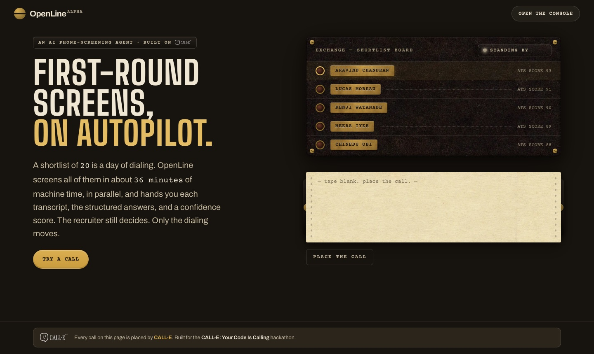
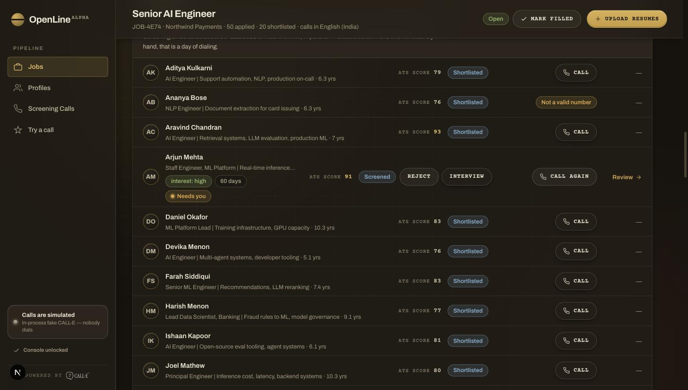
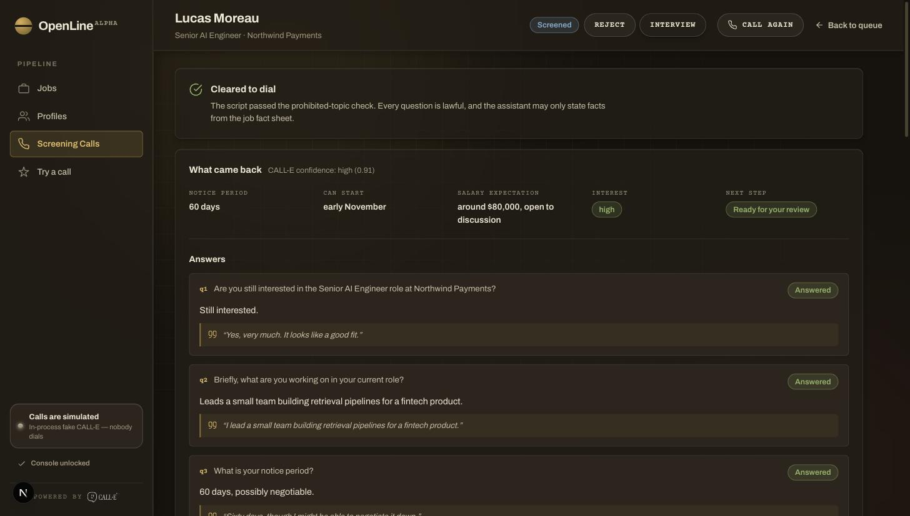
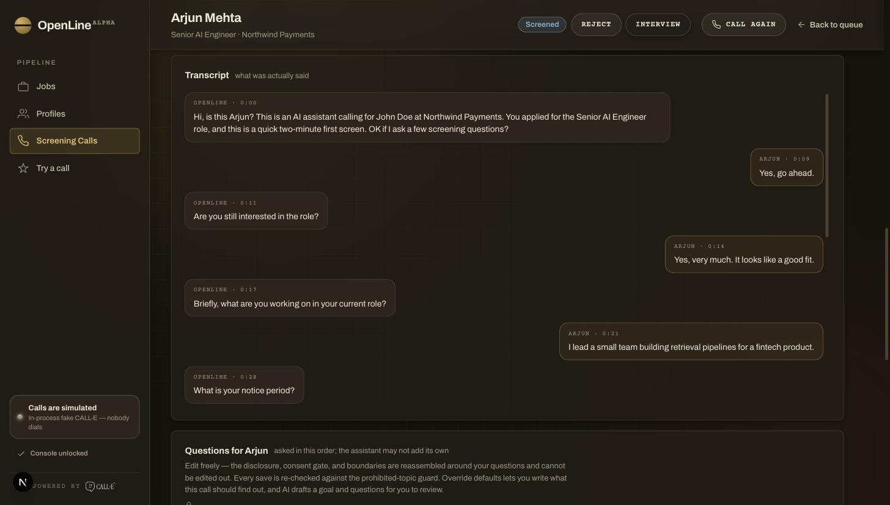
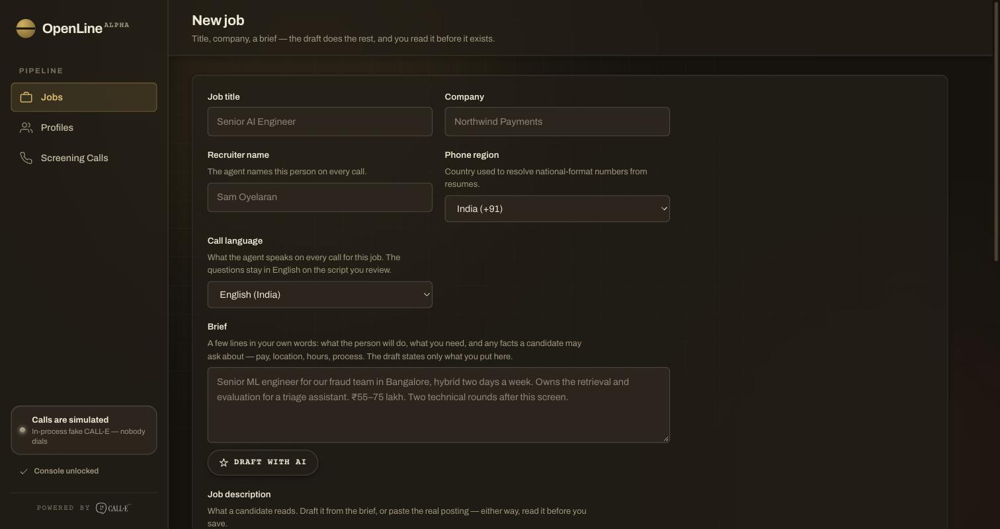

<div align="center">

# OpenLine

**Screen your whole shortlist by phone, without dialing.**

A recruiting console that phones every shortlisted candidate with an AI
screener built on [CALL-E](https://www.heycall-e.com/), then hands a human the
transcript, the structured result, and a confidence score.

[**Live demo**](https://openline-calle.vercel.app/) ·
[Architecture](ARCHITECTURE.md) · [Design system](DESIGN.md)

Built for the **CALL-E: Your Code Is Calling** hackathon.

</div>



---

## For judges

Every call here is real: it rings the phone you enter and spends a CALL-E
call. The operator token that unlocks the console is in the **testing
instructions of the Devpost submission**. It is not in this repository.

**https://openline-calle.vercel.app**, then **Try a call** in the sidebar.

1. Enter the operator token when the console asks for it.
2. **Try a call**, the quick test. Type your first name and your phone number with its country code,
   pick a language, tick the box, press **Call**, and confirm. Your phone rings
   within seconds. The agent says it is an AI assistant calling about the role,
   asks whether it may put a few screening questions to you, asks five, and
   hangs up. The transcript, the structured answers, and anything flagged for a
   person appear on the page when the call ends. **Nothing is saved.**
3. **The full flow**, if you have more time: open the **Senior AI Engineer**
   job, upload a resume PDF that carries your number, and press **Call** on its
   row once it lands on the shortlist. That candidate and the call are saved
   like any applicant, behind the token. **Review** shows the transcript;
   **Interview** or **Reject** is the recruiter's decision.

To see the whole loop with no phone ringing and no account, run it locally in
fake mode: [Run it locally with no calls](#run-it-locally-with-no-calls).

---



## The problem

An ATS hands a recruiter twenty names. Calling them is a day of work, so the
first five get a real conversation and the rest get an email, or nothing. The
shortlist is not the bottleneck — the phone is.

OpenLine calls all of them. Every candidate gets the same five-question basic
screen, a recruiter reads the exact words before anything dials, and every
answer comes back as a structured field paired with the candidate's own words.

**The recruiter still decides. Only the dialing moves.**

## What it does

- **Resume in, profile out.** Upload PDFs; each is stored in R2, parsed, and
  scored against the job description. Scores at or above the threshold
  auto-shortlist, and a human can overrule either way.
- **One basic screen, asked of everyone.** Interest, current work, notice
  period, start date, salary expectation. A live call proved model-written
  "fit" questions turn a two-minute screen into an interview and leave the
  structured result blank, so no model writes the questions — a recruiter can
  still edit them per candidate.
- **Readable and editable before it dials.** The exact spoken text is persisted
  as a record. Edit any question, or rebuild the lot; the frame is reassembled
  and re-guarded on every change.
- **Calls that answer back.** Candidates ask about salary, location, and
  timelines and get real answers from a fact sheet the recruiter writes.
- **Structured results with evidence.** Notice period, availability, interest,
  and each answer come back as fields, paired with verbatim quotes.
- **A pipeline, not a list.** Applied → Shortlisted → Screened → Interview
  scheduled → Selected, with Rejected and Withdrew as exits. A completed call
  advances the candidate to Screened; only a person writes an exit.
- **Jobs close.** A filled or closed posting stops accepting calls, enforced
  immediately before dialing. Reopening requires a written reason.





## The safety model

This is the part worth reading, and the part that does not get traded for a
smoother demo.

| | |
|---|---|
| **Disclosure and consent** | The agent states it is an AI, names who it is calling for, and asks permission before the first question. Decline ends the call. This text lives in a pure, unit-tested function, so it cannot vary between candidates or runs. |
| **The guard runs four times** | On every generated question, on the assembled script, inside the port immediately before dialing, and over the transcript afterwards. The model is never trusted to have obeyed its instructions. Forbidden topics — age, marital status, religion, caste, nationality, disability, gender, current salary — live in `lib/script/guard.ts`. |
| **One door to CALL-E** | Everything CALL-E-facing goes through `lib/calle/port.ts`. Guard re-inspection and E.164 validation live there, so no component, route, or script can route around them. |
| **Numbers are refused, not guessed** | `normalizePhone` returns a typed rejection reason. An unresolvable number keeps the candidate visible in the queue with the reason shown, rather than dialing a stranger in another country. |
| **OpenLine never rejects anyone** | There is no code path that declines a candidate. An uncertain call becomes a human's problem via `needsHuman`. Shortlisting happens upstream in the ATS and is shown with its reason so a human can argue with it. |
| **Nothing dials by itself** | No scheduler, no queue, no batch. Every call is a person pressing a button that names the candidate. |
| **The confirmation is checked on the server** | The button sends the candidate id and the script version the recruiter was looking at. `startCall` refuses if either moved — an edit bumped the version, a stale tab named someone else — and the recruiter reads the new words first. |
| **A public deployment is locked** | The whole console, reading included, needs the operator token: it holds applicants' names, resumes, and transcripts. Production with a live CALL-E key refuses to dial without a token configured. |
| **The key goes to one place** | There is no base-URL override. `CALLE_API_KEY` is only ever sent to `https://api.heycall-e.com`, and the fake transport never receives it. |

## How a call happens

```
resume PDF → R2 → OpenAI reads the pages (text or scanned) → parse + score → candidate row
                                                 (≥70 auto-shortlists, human overrides)
shortlisted candidate
  → preview    five template questions → guard each one → assembleTask()
               → guard the whole script → persist the exact words a recruiter can read
               → edit.ts reassembles the frame on any edit and re-runs the guard

  → dispatch   startCall:  operator unlocked? → confirmation matches candidate + version?
                           → job open? → atomic claim → port.dial()
                           → store CALL-E's id immediately → return
               finishCall: (detached) waitForCall → transcript + structured result
                           → guard the agent's own turns → needsHuman routing
                           → advance the candidate to Screened

  → reconcile  a row stuck at "dialing" is re-fetched by its stored id on page load
```

Three facts about CALL-E shape this design:

1. **There is no endpoint to list calls.** A `call_id` we fail to persist is a
   call we can never read back, so every dispatch writes its row *before* it
   dials.
2. **There is no mid-call tool calling.** Anything the agent may say has to be
   inlined into the task text up front — that is what the fact sheet is.
   Anything absent is deferred to a human, never guessed.
3. **Webhooks are unsigned.** Nothing is trusted from a webhook without
   re-fetching through the authenticated API, which is why reconciliation
   re-fetches by id instead.



## Run it locally with no calls

```bash
pnpm install
cp .env.example .env        # add DATABASE_URL — a free Neon database is enough
pnpm run db:migrate
pnpm run db:seed            # demo job + 50 applicants, 20 shortlisted
./start.sh --fake           # in-process fake CALL-E: no key, no phone rings
```

In fake mode the SDK runs against `lib/calle/fake-server.ts` instead of the
network. Press **Call** on a shortlisted row, or use **Try a call**, and it goes dialing →
completed in a few seconds with a canned transcript that follows the real
script (disclosure, consent, the five questions, one candidate question the
fact sheet cannot answer) and a schema-valid structured result. The guard, the
consent gate, the idempotency key, the needs-human routing and the pipeline
advance all run exactly as they would on a live call. Only the phone is fake.

The banner says which mode you are in every time the server starts. It is
also on screen, bottom-left, the whole time.

## Setup for real calls

Same steps, then:

| Variable | Required | Notes |
|---|---|---|
| `DATABASE_URL` | yes | Neon Postgres connection string |
| `CALLE_API_KEY` | for real calls | **Calls are live whenever this is set** and `OPENLINE_FAKE_CALLE` is not. They ring real phones and cost money. |
| `OPENLINE_FAKE_CALLE` | no | `1` to run against the in-process fake. Same as `./start.sh --fake`. |
| `OPENLINE_OPERATOR_TOKEN` | on any public deployment | Unlocks the console: reading it, dialing, and uploads. Production with a live key refuses to dial without it. |
| `OPENLINE_CALL_LOCALE` | no | BCP 47, e.g. `en-US`. Fallback voice locale; each job picks its own call language (English, Hindi, Tamil, Telugu, Kannada, Malayalam). |
| `OPENAI_API_KEY` | for resume upload | Resume parsing and scoring only. Screening questions do not use it. |
| `OPENAI_MODEL` | no | Defaults to `gpt-4o-mini` |
| `R2_*` | for resume upload | Without them the rest of the app still works. |

Every seeded number is US fiction-reserved (`555-01xx`) and cannot connect.
Test fixtures use the ACMA range Australia reserves for fiction. A real number
enters OpenLine only when someone types it into **Try a call**, which saves
nothing, or uploads a resume that carries it.

## Usage

1. Open the console and pick the seeded **Senior AI Engineer** job.
2. Upload resume PDFs, or use the seeded roster.
3. On a shortlisted row, **Call** — a two-step confirm that names the person.
   The first click prepares the script from the fixed template; **Review**
   shows the exact words, including the consent line, and lets you edit a
   question (the guard re-runs and the script version bumps).
4. Confirm. The page shows the call in progress and updates itself when the
   result lands.
5. Read the transcript, the structured result, and anything flagged for a
   human — then decide: **Interview** or **Reject**. OpenLine never makes that
   call; a person does.

## Side effects, and how to stop it

- **Calls are live whenever `CALLE_API_KEY` is set** and fake mode is off. One
  click on a confirmed row places one outbound CALL-E call to that candidate's
  number, which rings a real phone and spends one call of credit.
- **Try a call** places one call to the number typed in and saves nothing: no
  candidate, no call record. The transcript and result exist only on that
  page; close it mid-call and they cannot be shown again. CALL-E keeps its own
  record under the call id.
- Writes candidate and call records to Neon; stores uploaded PDFs in R2 and
  sends their text to OpenAI for parsing.
- **There is nothing queued.** Calls are single-shot: no scheduler, no
  recurring jobs, no automatic retries, nothing to cancel between runs.
- **A call CALL-E has accepted cannot be hung up from here.** The SDK exposes
  no cancel endpoint. The row shows CALL-E's call id; use the CALL-E dashboard
  if you need to intervene. A screening call runs about two minutes.
- **An ambiguous dial is never retried.** If the create request times out, the
  row stays at "dialing" with its idempotency key; the reconciler re-fetches
  it by the stored id on the next page load and records whatever CALL-E says
  happened. It never mints a new key or advances the candidate on a guess.
- To stop future calls for a role, **mark the job Filled or Closed**. The block
  is enforced in `startCall()` immediately before dialing, not only in the UI.
  Reopening requires a written reason.
- Moving a candidate to **Rejected** or **Withdrew** removes them from the
  callable set entirely. Only a person can do that.
- None of this deletes anything. Transcripts and results stay readable.

## Credentials

- Every key is read from the environment on the server and never reaches the
  browser. `.env.example` is the only env file that ships.
- `CALLE_API_KEY` is sent only to `https://api.heycall-e.com`. There is no
  base-URL setting, so an environment variable cannot redirect it.
- The operator token is compared in constant time and stored in an httpOnly
  cookie. It never appears in a URL. The scriptable routes accept it as an
  `x-openline-operator` header.
- Phone numbers are never rendered in full. The console shows whether a
  number resolved, and Try a call shows the last four digits.
- The whole console sits behind the operator token, not only dialing, because
  it holds applicants' names, resumes, and transcripts.

## How we tested

- `pnpm run verify` runs the test suite over the pure, safety-bearing logic: phone
  normalization, the guard, script assembly, the port (against the fake
  server), the fake mode, the dial gates, script edits, and pipeline stages.
- Live verification used real numbers typed in at call time; none is stored
  in the repository or the seed. What it changed: the original per-candidate,
  model-written questions were cut after a live call turned into a
  fifteen-minute interview with an empty structured result. The fixed
  five-question screen replaced them.
- Nothing in this repository is a real call: no transcripts, no recordings,
  no screenshots of a live conversation. The fake mode's transcript is canned.

## Stack

**Next.js 16** (App Router, Turbopack, React 19) · **TypeScript** · **Neon
Postgres** + **Drizzle** · **CALL-E SDK** (`@call-e/calle`) · **OpenAI** ·
**Cloudflare R2** · **Vitest** · plain CSS with design tokens. Node 20+.

## Layout

```
app/
  page.tsx              landing
  (app)/                the console — jobs, profiles, candidates, calls, unlock
  api/jobs/[id]/        preview (scriptable) and resume upload
components/             ui/, layout/, screening/, candidates/, jobs/, landing/
lib/
  calle/port.ts         the ONLY place that talks to CALL-E; picks live or fake
  calle/fake-server.ts  in-process fake of the CALL-E API — the no-call path
  operator.ts           who holds the console (cookie or header → gate verdict)
  script/               script assembly, the guard, the result schema
  screening/            preview, dispatch, gate, reconcile, human edits
  resume/               extract → parse + score → ingest
  candidates/           profile shape, pipeline stages
  phone/normalize.ts    E.164, or an explicit refusal
  db/                   Drizzle schema, queries, Neon client
```

## Development

```bash
pnpm run verify     # test + typecheck + lint — the gate before claiming done
pnpm run db:seed    # reset the demo data
./start.sh --test   # the full gate, then exit
```

Tests cover the pure, safety-bearing logic: phone normalization, the guard,
script assembly, the port and fake mode, the dial gates, script edits, and the
pipeline stages.

---

<div align="center">

Built with [CALL-E](https://www.heycall-e.com/) · **CALL-E: Your Code Is
Calling**

</div>
